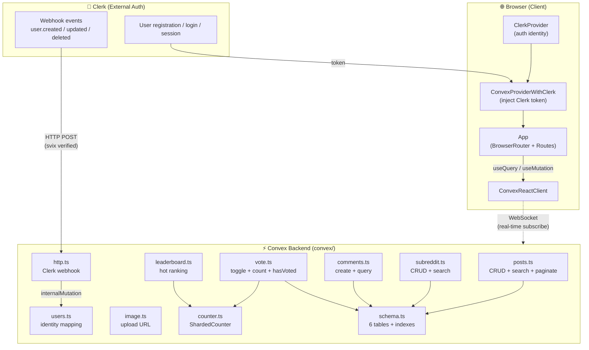

<div align="center">

# RedditLike

### A full-stack, real-time Reddit-style community platform

Built with **React 19 · Convex · Clerk · TypeScript** — no separate backend server, no REST client, no manual state syncing.

</div>

<br>

<p align="center">
  <a href="https://react.dev"></a>
  <a href="https://www.typescriptlang.org"></a>
  <a href="https://vitejs.dev"></a>
  <a href="https://convex.dev"></a>
  <a href="https://clerk.com"></a>
  <br>
  <a href="#quick-start"></a>
  <a href="./docs"></a>
  
  
  
</p>

---

</p>

## Overview

**RedditLike** is a real-time, Reddit-inspired community application where users can create communities (subreddits), publish posts with images, comment, and upvote/downvote content. Every interaction is instantly synchronized across all connected clients via Convex's WebSocket-based reactive queries — no refresh buttons, no polling, no stale data.

### What makes this project interesting

- **Zero-backend architecture** — Convex replaces your traditional API server, ORM, and real-time layer. Database queries are TypeScript functions; the client subscribes directly to query results.
- **Auth-as-a-service** — Clerk handles registration, login, session management, and user profiles. A secure webhook keeps the Convex `users` table in sync with Clerk's identity store.
- **Sharded counter for high-throughput writes** — Vote counts use `@convex-dev/sharded-counter` to avoid optimistic concurrency conflicts when many users vote simultaneously.
- **Full-stack type safety** — One TypeScript schema (`convex/schema.ts`) generates types for both the database layer and the React client. No codegen step, no drift.
- **Image uploads** — Files are uploaded directly to Convex's managed storage via a one-time upload URL, with a two-step commit (upload → attach storage ID to post).

---

## Features

| Category | Feature | Status |
|----------|---------|--------|
| **Communities** | Create subreddit with name validation & uniqueness check | ✅ |
| | View community page with hero, post count, and sidebar | ✅ |
| | Search communities by name (fuzzy search index) | ✅ |
| **Posts** | Create text + image posts within a community | ✅ |
| | View posts in expanded (detail) or summary (feed) layout | ✅ |
| | Delete own posts (owner-verified server-side) | ✅ |
| | Search posts within a subreddit | ✅ |
| | Hot/Ranking feed with vote score + comment count | ✅ |
| | Paginated community & user post lists | ✅ |
| **Comments** | Create comments on posts (auth-required) | ✅ |
| | Real-time comment list (auto-updates) | ✅ |
| **Voting** | Upvote / downvote toggle | ✅ |
| | Switch vote (auto-removes opposite vote) | ✅ |
| | Per-user vote state (highlight active vote) | ✅ |
| | Sharded counter for accurate, conflict-free totals | ✅ |
| **Users** | Clerk-powered authentication (sign in / sign up / sign out) | ✅ |
| | Webhook-synced user profile (Clerk → Convex) | ✅ |
| | Public profile page with post history | ✅ |
| **Search** | Context-aware: community search globally, post search within a subreddit | ✅ |
| | Keyboard-navigable results (enter to open first result) | ✅ |
| **UX** | Loading skeletons, empty states, not-found states | ✅ |
| | Responsive layout (mobile-adapted feed & subreddit pages) | ✅ |
| | Dark canvas with Linear-inspired design tokens | ✅ |

<details>
<summary><b>Planned / Roadmap</b></summary>

| Feature | Priority |
|---------|----------|
| Comment pagination (currently `take(50)`) | Medium |
| Edit posts after creation | Medium |
| Delete communities (with cascade) | Medium |
| Delete comments | Medium |
| Global post search (across all subreddits) | Medium |
| "Newest" feed (time-sorted, not just hot) | Low |
| Comment voting (upvote/downvote on comments) | Low |
| Community subscribe / personalized home feed | Low |
| User avatars in profile (from Clerk) | Low |
| Image deletion on post delete (storage cleanup) | Low |

</details>

---

## Tech Stack

| Layer | Technology | Version | Role |
|-------|-----------|---------|------|
| **UI Framework** | [React](https://react.dev) | 19.2 | Component rendering |
| **Language** | [TypeScript](https://www.typescriptlang.org) | 6.0 | Full-stack type safety |
| **Build Tool** | [Vite](https://vitejs.dev) | 8.1 | Dev server + bundler |
| **Routing** | [React Router](https://reactrouter.com) | 7.18 | Client-side routing |
| **Backend** | [Convex](https://convex.dev) | 1.42 | Real-time DB + functions + file storage |
| **Auth** | [Clerk](https://clerk.com) | 6.11 | Authentication & user management |
| **Auth Bridge** | `convex/react-clerk` | — | Injects Clerk token into Convex client |
| **Vote Counter** | [`@convex-dev/sharded-counter`](https://github.com/get-convex/sharded-counter) | 0.2 | Conflict-free high-throughput counting |
| **Webhook Verify** | [svix](https://svix.com) | 1.96 | Clerk webhook signature verification |
| **Icons** | [react-icons](https://react-icons.github.io/react-icons/) | 5.7 | Fa / Tb / Io icon sets |
| **Lint** | [oxlint](https://oxc.rs) | 1.69 | Fast linter |

---

## Architecture



<details>
<summary><b>📊 Data Flow Details</b></summary>

### Real-time subscription flow
```
Component renders → useQuery(api.func, args) → WebSocket subscription established
  → Convex runs query → returns result → component renders
  → Any DB change matching the query → Convex re-runs → pushes new result → auto re-render
```

### Auth flow (dual-channel sync)
```
Channel 1 (async):  Clerk user event → webhook (http.ts) → upsertFromClerk / deleteFromClerk
Channel 2 (sync):   API call → ctx.auth.getUserIdentity() → getOrCreateCurrentUser (fallback)
```

### Image upload flow (two-step commit)
```
1. SubmitPage → api.image.generateUploadUrl() → Convex returns one-time upload URL
2. fetch(uploadUrl, { POST, body: file }) → file stored in Convex file storage → returns { storageId }
3. api.posts.create({ ..., storageId }) → post created with image reference
```

### Vote toggle flow (with sharded counter)
```
toggleUpvote(postId):
  1. Check existing upvote → if exists: delete + counter.dec (toggle off)
  2. Check existing downvote → if exists: delete + counter.dec (switch vote)
  3. Insert upvote + counter.inc
```

</details>

---

## Project Structure

```
RedditLike/
├── src/                              # Frontend source
│   ├── main.tsx                      # Entry: ClerkProvider → ConvexProvider → App
│   ├── App.tsx                       # Route definitions
│   ├── index.css                     # Global styles + design tokens
│   ├── components/                   # 8 reusable UI components
│   │   ├── Layout.tsx                #   Page shell (Navbar + Outlet)
│   │   ├── Navbar.tsx                #   Top navigation
│   │   ├── Feed.tsx                  #   Hot posts feed
│   │   ├── PostCard.tsx              #   ⭐ Core composite component
│   │   ├── Comments.tsx              #   Single comment renderer
│   │   ├── SearchBar.tsx             #   Context-aware search
│   │   ├── CreateCommunityModal.tsx  #   Community creation dialog
│   │   └── CreateDowndown.tsx        #   "Create" dropdown menu
│   ├── pages/                        # 5 page-level components
│   │   ├── HomePage.tsx              #   / (hot feed)
│   │   ├── SubredditPage.tsx         #   /r/:name (community)
│   │   ├── postPage.tsx              #   /post/:id (detail)
│   │   ├── SubmitPage.tsx            #   /r/:name/submit (create post)
│   │   └── ProfilePage.tsx           #   /u/:username (profile)
│   └── styles/                       # 13 component-scoped CSS files
│
├── convex/                           # Convex backend source
│   ├── schema.ts                     # 6 tables: users, subreddits, posts, comments, upvote, downvote
│   ├── users.ts                      # Identity mapping + Clerk webhook sync
│   ├── posts.ts                      # CRUD + search + paginated list
│   ├── subreddit.ts                  # CRUD + search
│   ├── comments.ts                   # Create + query
│   ├── vote.ts                       # Toggle + count + hasVoted (factory pattern)
│   ├── leaderboard.ts                # Hot ranking (score + comment count)
│   ├── image.ts                      # Upload URL generation
│   ├── counter.ts                    # ShardedCounter instance
│   ├── http.ts                       # Clerk webhook HTTP endpoint
│   ├── auth.config.ts                # Convex auth provider config
│   └── convex.config.ts              # Component registration (sharded-counter)
│
├── docs/                             # 📚 Full project analysis (8 reports)
│   ├── README.md                     #   Analysis index
│   ├── 01-architecture/              #   Tech stack & data flow
│   ├── 02-components/                #   Component deep-dive
│   ├── 03-pages/                     #   Page logic analysis
│   ├── 04-styles/                    #   Design system audit
│   ├── 05-backend/                   #   API contracts
│   └── 06-quality/                   #   Improvement checklist (53 items)
│
├── package.json
├── vite.config.ts
└── tsconfig.json
```

<details>
<summary><b>🗂️ Database Schema</b></summary>

```typescript
// convex/schema.ts
users:        { username, externalId }              // indexed by externalId, username
subreddits:   { name, normalizedName, description?, authorId }  // + search index on name
posts:        { title, body?, authorId, subredditId, image? }   // + search index on title
comments:     { body, authorId, postId }
upvote:       { postId, userId }                    // indexed by postId+userId (composite)
downvote:     { postId, userId }                    // indexed by postId+userId (composite)
```

**Indexes:**
- `users.by_externalId` — Clerk identity lookup
- `users.by_username` — public profile lookup
- `subreddits.by_normalizedName` — case-insensitive name lookup
- `subreddits.search_name` — fuzzy search on community name
- `posts.by_authorId` — user's post history
- `posts.by_subredditId` — community post listing
- `posts.search_title` — fuzzy search on post title (filterable by subreddit)
- `comments.by_postId` — comment thread lookup
- `upvote/downvote.by_postId_and_userId` — hasVoted check (composite index)

</details>

---

## Routes

| Path | Page | Description |
|------|------|-------------|
| `/` | HomePage | Hot posts feed (top 10 by score + comments) |
| `/r/:subredditName` | SubredditPage | Community page with hero, posts, and about sidebar |
| `/r/:subredditName/submit` | SubmitPage | Create a new post in the community |
| `/post/:postId` | PostPage | Single post detail view (expanded) |
| `/u/:username` | ProfilePage | User profile with post history |
| `*` | → `/` | Fallback redirect to home |

---

## Quick Start

### Prerequisites

- **Node.js** ≥ 20
- **npm** ≥ 10
- A [Clerk](https://clerk.com) account (free tier is fine)
- A [Convex](https://convex.dev) account (free tier is fine)

### Setup

```bash
# 1. Clone the repository
git clone https://github.com/your-username/RedditLike.git
cd RedditLike

# 2. Install dependencies
npm install

# 3. Set up environment variables
#    Create a .env.local file in the project root:
cp .env.example .env.local  # if available, or create manually
```

<details>
<summary><b>📝 Environment Variables</b></summary>

Create a `.env.local` file with the following:

```env
# Convex
VITE_CONVEX_URL=https://your-deployment.convex.cloud

# Clerk
VITE_CLERK_PUBLISHABLE_KEY=pk_test_your_clerk_key
```

And in your Convex dashboard, set:

```env
CLERK_WEBHOOK_SECRET=whsec_your_webhook_secret
```

</details>

```bash
# 4. Set up Convex backend
npx convex dev

# 5. Set up Clerk webhook
#    In Clerk Dashboard → Webhooks → add endpoint:
#    URL: https://your-deployment.convex.cloud/clerk-users-webhook
#    Events: user.created, user.updated, user.deleted

# 6. Start the development server
npm run dev
```

### Available Scripts

| Command | Description |
|---------|-------------|
| `npm run dev` | Start Vite dev server with HMR |
| `npm run build` | Type-check (`tsc -b`) + production build (`vite build`) |
| `npm run preview` | Preview the production build locally |
| `npm run lint` | Run oxlint (0 errors, 0 warnings ✅) |

---

## Analysis Documentation

This project includes a **comprehensive 8-layer analysis** in the [`docs/`](./docs) directory, covering everything from architecture to improvement checklists:

| # | Category | File | What's Inside |
|---|----------|------|---------------|
| 01 | Architecture | [`tech-stack-and-data-flow.md`](./docs/01-architecture/tech-stack-and-data-flow.md) | Tech stack, architecture diagram, directory structure, data flow, routes, component responsibilities |
| 02 | Components | [`component-analysis.md`](./docs/02-components/component-analysis.md) | Deep-dive on all 8 components: props, state, Convex API calls, interactions, reusability, issues |
| 03 | Pages | [`page-analysis.md`](./docs/03-pages/page-analysis.md) | All 5 pages: data loading, interaction flows, state handling, component collaboration |
| 04 | Styles | [`design-system.md`](./docs/04-styles/design-system.md) | Design tokens, color/spacing/radius/typography systems, responsive strategy, CSS organization |
| 05 | Backend | [`api-contracts.md`](./docs/05-backend/api-contracts.md) | All 20 API contracts, type contracts, auth model, performance analysis, redundancy audit |
| 06 | Quality | [`improvement-checklist.md`](./docs/06-quality/improvement-checklist.md) | 53 issues ranked P0-P3, 6-phase improvement roadmap, health score breakdown |

---

## Key Technical Decisions

<details>
<summary><b>⚡ Why Convex instead of a traditional backend?</b></summary>

Convex eliminates the entire API server layer. Instead of writing Express routes, ORMs, and WebSocket handlers, you write TypeScript functions that run on Convex's infrastructure. The React client subscribes directly to query results via WebSocket — any database change automatically triggers a re-run of affected queries and pushes new results to all connected clients. This means **zero stale data, zero polling, zero manual cache invalidation**.

</details>

<details>
<summary><b>🔐 Why Clerk instead of custom auth?</b></summary>

Building authentication from scratch is risky and time-consuming. Clerk provides a complete auth solution — sign in, sign up, social login, MFA, session management, user profiles — as a hosted service. The `ConvexProviderWithClerk` bridge automatically injects the Clerk session token into every Convex call, so backend functions can access the authenticated identity via `ctx.auth.getUserIdentity()` without any custom token handling.

</details>

<details>
<summary><b>🗳️ Why ShardedCounter for votes?</b></summary>

When many users vote on the same post simultaneously, a naive counter (read → increment → write) causes optimistic concurrency conflicts — Convex would reject conflicting writes. `@convex-dev/sharded-counter` distributes the counter across multiple shards, allowing parallel increments without conflicts. The shards are transparently aggregated when reading the final count.

</details>

<details>
<summary><b>🎨 Why a design token system in index.css?</b></summary>

`src/index.css` defines a complete Linear-inspired dark-mode design token system (colors, spacing, radius, typography). This establishes a single source of truth for the visual language. *(Note: the component CSS files are currently in transition to fully adopt these tokens — see the [analysis](./docs/04-styles/design-system.md) for details.)*

</details>

---

## Project Health

| Metric | Score | Details |
|--------|-------|---------|
| **Lint** |  | 0 errors, 0 warnings (oxlint) |
| **Type Check** |  | `tsc --noEmit` passes |
| **Type Safety** |  | One unsafe type assertion (`postId as Id`) |
| **Dead Code** |  | 1 unused file (`messages.ts`), 2 unused helper functions |
| **Auth Coverage** |  | Backend complete, 2 frontend gaps |
| **Data Integrity** |  | No cascade deletion yet |
| **Design Token Adoption** |  | Tokens defined but not yet referenced by components |
| **Overall** |  | See [full analysis](./docs/06-quality/improvement-checklist.md) |

---

## Contributing

This is a personal learning project, but feedback and suggestions are welcome! Please check the [improvement checklist](./docs/06-quality/improvement-checklist.md) for known issues and planned work.

---

## License

This project is licensed under the **MIT License** — see the [LICENSE](./LICENSE) file for details.

---

<div align="center">

<sub>Built as a full-stack TypeScript learning project. If you found this helpful, consider giving it a ⭐!</sub>

</div>
