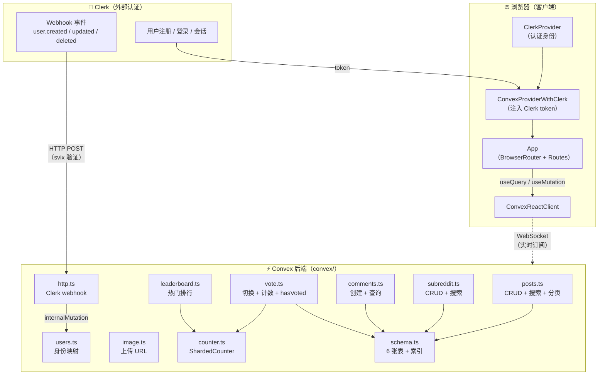

<div align="center">

# RedditLike

### 一个全栈、实时的 Reddit 风格社区平台

使用 **React 19 · Convex · Clerk · TypeScript** 构建：无需单独的后端服务器，无需 REST 客户端，也无需手动同步状态。

</div>

<br>

<p align="center">
  <a href="https://react.dev"></a>
  <a href="https://www.typescriptlang.org"></a>
  <a href="https://vitejs.dev"></a>
  <a href="https://convex.dev"></a>
  <a href="https://clerk.com"></a>
  <br>
  <a href="#快速开始"></a>
  <a href="./docs"></a>
  
  
  
</p>

---

## 概览

**RedditLike** 是一个实时的 Reddit 风格社区应用。用户可以创建社区（subreddits）、发布带图片的帖子、发表评论，并对内容进行赞同或反对。所有交互都会通过 Convex 基于 WebSocket 的响应式查询即时同步到所有已连接客户端：不需要刷新按钮，不需要轮询，也不会看到过期数据。

### 这个项目的亮点

- **零后端服务器架构**：Convex 替代传统 API 服务器、ORM 和实时通信层。数据库查询就是 TypeScript 函数，客户端可以直接订阅查询结果。
- **认证即服务**：Clerk 负责注册、登录、会话管理和用户资料。安全 webhook 会让 Convex 的 `users` 表与 Clerk 身份数据保持同步。
- **用于高吞吐写入的分片计数器**：投票计数使用 `@convex-dev/sharded-counter`，避免大量用户同时投票时出现乐观并发冲突。
- **全栈类型安全**：一个 TypeScript schema（`convex/schema.ts`）同时为数据库层和 React 客户端生成类型，减少前后端类型漂移。
- **图片上传**：文件通过一次性上传 URL 直接上传到 Convex 托管存储，并采用两步提交流程（上传 → 将 storage ID 关联到帖子）。

---

## 功能

| 分类 | 功能 | 状态 |
|----------|---------|--------|
| **社区** | 创建 subreddit，包含名称校验和唯一性检查 | ✅ |
| | 查看社区页面，包含头图、帖子数量和侧边栏 | ✅ |
| | 按名称搜索社区（模糊搜索索引） | ✅ |
| **帖子** | 在社区内创建文本 + 图片帖子 | ✅ |
| | 以详情布局或摘要信息流布局查看帖子 | ✅ |
| | 删除自己的帖子（服务端校验所有者） | ✅ |
| | 在某个 subreddit 内搜索帖子 | ✅ |
| | 热门 / 排行信息流，基于投票分数和评论数 | ✅ |
| | 社区和用户帖子列表分页 | ✅ |
| **评论** | 在帖子下发表评论（需要登录） | ✅ |
| | 实时评论列表（自动更新） | ✅ |
| **投票** | 赞同 / 反对切换 | ✅ |
| | 切换投票（自动移除相反投票） | ✅ |
| | 每个用户的投票状态（高亮当前投票） | ✅ |
| | 使用分片计数器获得准确、无冲突的总数 | ✅ |
| **用户** | Clerk 驱动的认证（登录 / 注册 / 退出） | ✅ |
| | 通过 webhook 同步用户资料（Clerk → Convex） | ✅ |
| | 带发帖历史的公开个人主页 | ✅ |
| **搜索** | 上下文感知：全局搜索社区，在 subreddit 内搜索帖子 | ✅ |
| | 支持键盘导航结果（回车打开第一个结果） | ✅ |
| **体验** | 加载骨架屏、空状态、未找到状态 | ✅ |
| | 响应式布局（适配移动端的信息流和 subreddit 页面） | ✅ |
| | 深色画布和 Linear 风格设计 token | ✅ |

<details>
<summary><b>计划 / 路线图</b></summary>

| 功能 | 优先级 |
|---------|----------|
| 评论分页（目前为 `take(50)`） | 中 |
| 创建后编辑帖子 | 中 |
| 删除社区（包含级联删除） | 中 |
| 删除评论 | 中 |
| 全局帖子搜索（跨所有 subreddits） | 中 |
| “最新”信息流（按时间排序，不只看热门） | 低 |
| 评论投票（对评论赞同 / 反对） | 低 |
| 订阅社区 / 个性化首页信息流 | 低 |
| 个人主页显示用户头像（来自 Clerk） | 低 |
| 删除帖子时删除图片（清理存储） | 低 |

</details>

---

## 技术栈

| 层级 | 技术 | 版本 | 作用 |
|-------|-----------|---------|------|
| **UI 框架** | [React](https://react.dev) | 19.2 | 组件渲染 |
| **语言** | [TypeScript](https://www.typescriptlang.org) | 6.0 | 全栈类型安全 |
| **构建工具** | [Vite](https://vitejs.dev) | 8.1 | 开发服务器 + 打包工具 |
| **路由** | [React Router](https://reactrouter.com) | 7.18 | 客户端路由 |
| **后端** | [Convex](https://convex.dev) | 1.42 | 实时数据库 + 函数 + 文件存储 |
| **认证** | [Clerk](https://clerk.com) | 6.11 | 认证与用户管理 |
| **认证桥接** | `convex/react-clerk` | — | 将 Clerk token 注入 Convex 客户端 |
| **投票计数器** | [`@convex-dev/sharded-counter`](https://github.com/get-convex/sharded-counter) | 0.2 | 无冲突的高吞吐计数 |
| **Webhook 验证** | [svix](https://svix.com) | 1.96 | Clerk webhook 签名验证 |
| **图标** | [react-icons](https://react-icons.github.io/react-icons/) | 5.7 | Fa / Tb / Io 图标集 |
| **Lint** | [oxlint](https://oxc.rs) | 1.69 | 快速 linter |

---

## 架构



<details>
<summary><b>📊 数据流详情</b></summary>

### 实时订阅流程
```
组件渲染 → useQuery(api.func, args) → 建立 WebSocket 订阅
  → Convex 运行查询 → 返回结果 → 组件渲染
  → 任何匹配该查询的数据库变更 → Convex 重新运行查询 → 推送新结果 → 自动重新渲染
```

### 认证流程（双通道同步）
```
通道 1（异步）：Clerk 用户事件 → webhook (http.ts) → upsertFromClerk / deleteFromClerk
通道 2（同步）：API 调用 → ctx.auth.getUserIdentity() → getOrCreateCurrentUser（兜底）
```

### 图片上传流程（两步提交）
```
1. SubmitPage → api.image.generateUploadUrl() → Convex 返回一次性上传 URL
2. fetch(uploadUrl, { POST, body: file }) → 文件存入 Convex 文件存储 → 返回 { storageId }
3. api.posts.create({ ..., storageId }) → 创建带图片引用的帖子
```

### 投票切换流程（使用分片计数器）
```
toggleUpvote(postId):
  1. 检查已有 upvote → 如果存在：删除 + counter.dec（取消投票）
  2. 检查已有 downvote → 如果存在：删除 + counter.dec（切换投票）
  3. 插入 upvote + counter.inc
```

</details>

---

## 项目结构

```
RedditLike/
├── src/                              # 前端源码
│   ├── main.tsx                      # 入口：ClerkProvider → ConvexProvider → App
│   ├── App.tsx                       # 路由定义
│   ├── index.css                     # 全局样式 + 设计 token
│   ├── components/                   # 8 个可复用 UI 组件
│   │   ├── Layout.tsx                #   页面外壳（Navbar + Outlet）
│   │   ├── Navbar.tsx                #   顶部导航
│   │   ├── Feed.tsx                  #   热门帖子信息流
│   │   ├── PostCard.tsx              #   ⭐ 核心组合组件
│   │   ├── Comments.tsx              #   单条评论渲染器
│   │   ├── SearchBar.tsx             #   上下文感知搜索
│   │   ├── CreateCommunityModal.tsx  #   社区创建弹窗
│   │   └── CreateDowndown.tsx        #   “创建”下拉菜单
│   ├── pages/                        # 5 个页面级组件
│   │   ├── HomePage.tsx              #   /（热门信息流）
│   │   ├── SubredditPage.tsx         #   /r/:name（社区）
│   │   ├── postPage.tsx              #   /post/:id（详情）
│   │   ├── SubmitPage.tsx            #   /r/:name/submit（创建帖子）
│   │   └── ProfilePage.tsx           #   /u/:username（个人主页）
│   └── styles/                       # 13 个组件级 CSS 文件
│
├── convex/                           # Convex 后端源码
│   ├── schema.ts                     # 6 张表：users、subreddits、posts、comments、upvote、downvote
│   ├── users.ts                      # 身份映射 + Clerk webhook 同步
│   ├── posts.ts                      # CRUD + 搜索 + 分页列表
│   ├── subreddit.ts                  # CRUD + 搜索
│   ├── comments.ts                   # 创建 + 查询
│   ├── vote.ts                       # 切换 + 计数 + hasVoted（工厂模式）
│   ├── leaderboard.ts                # 热门排行（分数 + 评论数）
│   ├── image.ts                      # 上传 URL 生成
│   ├── counter.ts                    # ShardedCounter 实例
│   ├── http.ts                       # Clerk webhook HTTP 端点
│   ├── auth.config.ts                # Convex 认证提供方配置
│   └── convex.config.ts              # 组件注册（sharded-counter）
│
├── docs/                             # 📚 完整项目分析（8 份报告）
│   ├── README.md                     #   分析索引
│   ├── 01-architecture/              #   技术栈与数据流
│   ├── 02-components/                #   组件深度分析
│   ├── 03-pages/                     #   页面逻辑分析
│   ├── 04-styles/                    #   设计系统审计
│   ├── 05-backend/                   #   API 契约
│   └── 06-quality/                   #   改进清单（53 项）
│
├── package.json
├── vite.config.ts
└── tsconfig.json
```

<details>
<summary><b>🗂️ 数据库 Schema</b></summary>

```typescript
// convex/schema.ts
users:        { username, externalId }              // 按 externalId、username 建索引
subreddits:   { name, normalizedName, description?, authorId }  // + name 搜索索引
posts:        { title, body?, authorId, subredditId, image? }   // + title 搜索索引
comments:     { body, authorId, postId }
upvote:       { postId, userId }                    // 按 postId+userId 建复合索引
downvote:     { postId, userId }                    // 按 postId+userId 建复合索引
```

**索引：**
- `users.by_externalId`：Clerk 身份查询
- `users.by_username`：公开个人主页查询
- `subreddits.by_normalizedName`：大小写不敏感的名称查询
- `subreddits.search_name`：社区名称模糊搜索
- `posts.by_authorId`：用户发帖历史
- `posts.by_subredditId`：社区帖子列表
- `posts.search_title`：帖子标题模糊搜索（可按 subreddit 过滤）
- `comments.by_postId`：评论串查询
- `upvote/downvote.by_postId_and_userId`：hasVoted 检查（复合索引）

</details>

---

## 路由

| 路径 | 页面 | 说明 |
|------|------|-------------|
| `/` | HomePage | 热门帖子信息流（按分数 + 评论数取前 10） |
| `/r/:subredditName` | SubredditPage | 社区页面，包含头图、帖子和简介侧边栏 |
| `/r/:subredditName/submit` | SubmitPage | 在社区中创建新帖子 |
| `/post/:postId` | PostPage | 单个帖子的详情视图（展开） |
| `/u/:username` | ProfilePage | 带发帖历史的用户个人主页 |
| `*` | → `/` | 兜底重定向到首页 |

---

## 快速开始

### 前置要求

- **Node.js** ≥ 20
- **npm** ≥ 10
- 一个 [Clerk](https://clerk.com) 账号（免费套餐即可）
- 一个 [Convex](https://convex.dev) 账号（免费套餐即可）

### 安装与配置

```bash
# 1. 克隆仓库
git clone https://github.com/your-username/RedditLike.git
cd RedditLike

# 2. 安装依赖
npm install

# 3. 设置环境变量
#    在项目根目录创建 .env.local 文件：
cp .env.example .env.local  # 如果有该文件；否则手动创建
```

<details>
<summary><b>📝 环境变量</b></summary>

创建 `.env.local` 文件，并写入：

```env
# Convex
VITE_CONVEX_URL=https://your-deployment.convex.cloud

# Clerk
VITE_CLERK_PUBLISHABLE_KEY=pk_test_your_clerk_key
```

并在 Convex dashboard 中设置：

```env
CLERK_WEBHOOK_SECRET=whsec_your_webhook_secret
```

</details>

```bash
# 4. 启动 Convex 后端开发环境
npx convex dev

# 5. 设置 Clerk webhook
#    在 Clerk Dashboard → Webhooks → 添加 endpoint：
#    URL: https://your-deployment.convex.cloud/clerk-users-webhook
#    Events: user.created, user.updated, user.deleted

# 6. 启动开发服务器
npm run dev
```

### 可用脚本

| 命令 | 说明 |
|---------|-------------|
| `npm run dev` | 启动带 HMR 的 Vite 开发服务器 |
| `npm run build` | 类型检查（`tsc -b`）+ 生产构建（`vite build`） |
| `npm run preview` | 在本地预览生产构建 |
| `npm run lint` | 运行 oxlint（0 错误、0 警告 ✅） |

---


## 关键技术决策

<details>
<summary><b>⚡ 为什么使用 Convex，而不是传统后端？</b></summary>

Convex 消除了整个 API 服务器层。你不再需要编写 Express 路由、ORM 和 WebSocket handler，而是编写运行在 Convex 基础设施上的 TypeScript 函数。React 客户端通过 WebSocket 直接订阅查询结果：任何数据库变更都会自动触发受影响查询重新运行，并把新结果推送给所有已连接客户端。这意味着**没有过期数据、没有轮询、没有手动缓存失效**。

</details>

<details>
<summary><b>🔐 为什么使用 Clerk，而不是自定义认证？</b></summary>

从零构建认证系统风险高、耗时长。Clerk 以托管服务的形式提供完整认证能力：登录、注册、社交登录、MFA、会话管理和用户资料。`ConvexProviderWithClerk` 桥接层会自动把 Clerk 会话 token 注入每次 Convex 调用，因此后端函数可以通过 `ctx.auth.getUserIdentity()` 获取已认证身份，而不需要自定义 token 处理。

</details>

<details>
<summary><b>🗳️ 为什么投票使用 ShardedCounter？</b></summary>

当很多用户同时给同一篇帖子投票时，朴素计数器（读取 → 加一 → 写入）会导致乐观并发冲突，Convex 会拒绝冲突写入。`@convex-dev/sharded-counter` 会把计数分散到多个分片中，使并行递增可以无冲突地完成。读取最终计数时，这些分片会被透明聚合。

</details>

<details>
<summary><b>🎨 为什么在 index.css 中建立设计 token 系统？</b></summary>

`src/index.css` 定义了一套完整的 Linear 风格深色模式设计 token 系统（颜色、间距、圆角、排版）。它为视觉语言建立了单一事实来源。*（注意：组件 CSS 文件目前仍在逐步迁移到完整使用这些 token 的过程中，详情请参见[分析文档](./docs/04-styles/design-system.md)。）*

</details>

---

## 项目进度

| 指标 | 分数 | 详情 |
|--------|-------|---------|
| **Lint** |  | 0 错误、0 警告（oxlint） |
| **类型检查** |  | `tsc --noEmit` 通过 |
| **类型安全** |  | 有一个不安全的类型断言（`postId as Id`） |
| **认证覆盖** |  | 后端完整，前端有 2 个缺口 |
| **数据完整性** |  | 尚未实现级联删除 |
| **设计 token 采用率** |  | 已定义 token，但组件尚未引用 |
| **整体** |  | 参见[完整分析](./docs/06-quality/improvement-checklist.md) |

---

## 贡献

个人学习项目，但欢迎反馈和建议！发现问题欢迎提交issue。

---

## 许可证

本项目基于 **MIT License** 授权，详情请参见 [LICENSE](./LICENSE) 文件。

---

<div align="center">

<sub>作为全栈 TypeScript 学习项目构建。如果这个项目对你有帮助，欢迎给它一个 ⭐！</sub>

</div>
